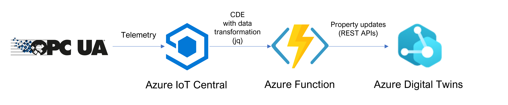

# IoTC Industrial ADT

This repository contains tools and documentation for a sample integration solution between IIoT (OPC-UA) and Azure Digital Twins through Azure IoT Central.
The provided tools and learning paths apply to several use cases and can be extended to support more Industrial protocols in the future.

## Architecture



An OPC-UA client sends data to an IoT Central Application where a continuous data export has been created. The export has an Azure Function as destination, configured with Webhook type and a data transformation query to translate the OPC payload to an ADT compatible one.
Finally the Azure Functions trigger property updates on the Azure Digital Twins instance.

The sample function in this repository, accepts POST requests with a payload defined in this way:

```json
{
  "twinRawId": "<DIGITAL_TWIN_COMPLEX_ID>",
  "twinName": "[FRIENDLY_NAME (OPTIONAL)]",
  "modelId": "[DTDL_MODEL_ID (OPTIONAL)]",
  "value": "<PROPERTY_VALUE>"
}
```

where _<DIGITAL_TWIN_COMPLEX_ID>_ is the unique identifier of a property in a Twin in the form _'twin_id/property_name'_ or _'twin_id/component_name/property_name'_.

Then it parses the _id_ to build the right API URL and update the property with the requested value.

The _jq_ transformation query to produce such an input can be quite complex and hard to manually define without incurring in errors. For this reason, we provide a [multi-platform configuration tool](#configuration-tool) to help.

## Resources Setup

Instructions to create all required resources like Azure Function and Digital Twins are available [here](./docs/setup.md).

## Configuration Tool

The mapping configuration tool is an Electron application available for Windows, Mac OS and Linux. We do not provide binary releases, all the steps to get it running are detailed [here](./mapper-tool/README.md).
