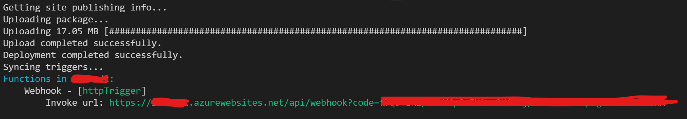
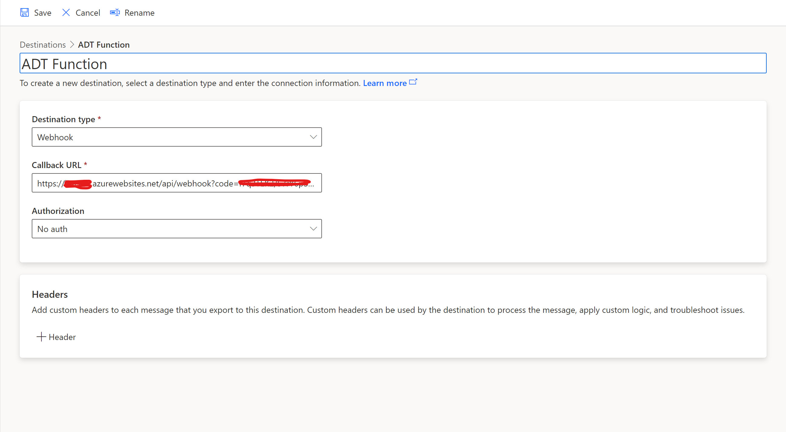
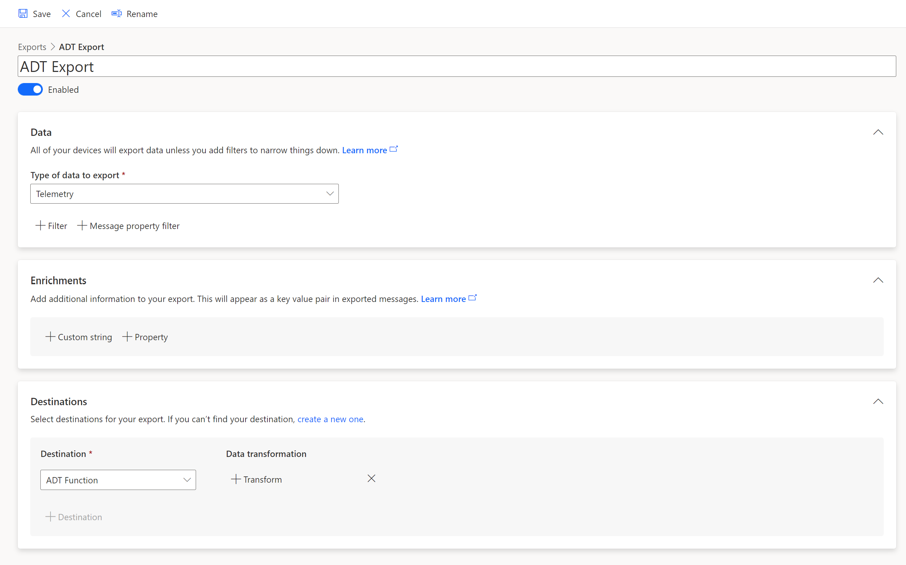
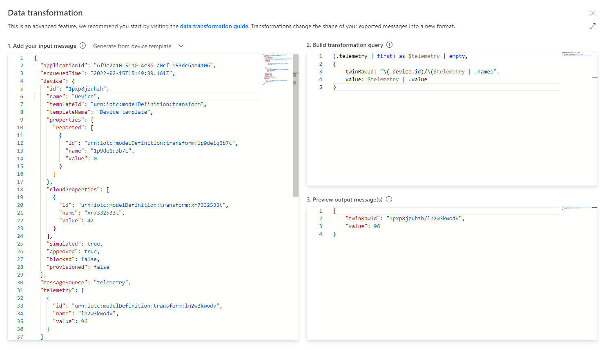

# Setup

Clone this repository to get sample code for the Azure Function to be used as export destination in IoT Central.

## Resources

1. Azure Digital Twins
2. Azure Functions
3. Azure IoT Central

## 1. Deploy Azure Digital Twins

If you already have an ADT instance you can skip to [step 2](#2-deploy-the-sample-function), otherwise follow the instructions in ["Set up an instance and authentication"](https://docs.microsoft.com/en-us/azure/digital-twins/how-to-set-up-instance-portal).

After you set up your instance, make a note of the following values. You'll need these values to connect to the instance later:

- The instance's host name or endpoint. You can find the host name in the Azure portal.
- The Azure subscription that you used to create the instance. Either its name or its ID will work. You can find the subscription on your instance's Overview page in the Azure portal.

## 2. Deploy the sample function

Before deploying function code, you need to create an app in your subscription. A consumption plan is the preferred choice for the kind of the load expected in the current scenario.
Instructions are available for creating the function app through [Azure Portal](https://docs.microsoft.com/en-us/azure/azure-functions/functions-create-function-app-portal#create-a-function-app), [Azure CLI](https://docs.microsoft.com/en-us/azure/azure-functions/scripts/functions-cli-create-serverless) or [Powershell](https://docs.microsoft.com/en-us/azure/azure-functions/create-first-function-cli-powershell?tabs=azure-cli%2Cbrowser#create-supporting-azure-resources-for-your-function).

For Azure CLI, this become as simple as running this script:

```bash
#!/bin/bash

# Function app and storage account names must be unique.
SUBSCRIPTION_ID="<subscription_id>"
RESOURCE_GROUP="<resource_group_name>"
STORAGE_NAME="<storage_account_name>"
FUNCTION_APP_NAME="<functionapp_name>"
REGION="<region_name>"

# Create a resource group.
az group create --name "$RESOURCE_GROUP" --location "$REGION"

# Create an Azure storage account in the resource group.
az storage account create \
  --name "$STORAGE_NAME" \
  --location "$REGION" \
  --resource-group "$RESOURCE_GROUP" \
  --sku Standard_LRS

# Create a serverless function app in the resource group.
az functionapp create \
  --name "$FUNCTION_APP_NAME" \
  --storage-account "$STORAGE_NAME" \
  --consumption-plan-location "$REGION" \
  --resource-group "$RESOURCE_GROUP" \
  --os-type linux \
  --runtime node \
  --runtime-version 16 \
  --functions-version 4
```

### Setup development environment

The easiest way to deploy the function to an Azure subscription is using the **Azure Function Core Tools** available on NPM.
Extensive instructions are available on the [official repo](https://github.com/Azure/azure-functions-core-tools).

### Installation

```sh
npm i -g azure-functions-core-tools@4 --unsafe-perm true
```

Below is a required step to point the Azure Function to the Azure Digital Twins endpoint.

Edit the _local.settings.json_ file in the function root folder ( or create if it does not exist) and replace the value for the ADT_INSTANCE with the Digital Twins endpoint URL.

_e.g._

```json
{
  "IsEncrypted": false,
  "Values": {
    "FUNCTIONS_WORKER_RUNTIME": "node",
    "ADT_INSTANCE": "https://opcuadt.api.eus2.digitaltwins.azure.net"
  }
}
```

### Deployment

Make sure Azure CLI is logged in and the right subscription has been selected, otherwise run _"az login"_ and _"az account set"_ to select it.

Move to the sample function folder and build the project before publishing it.

```sh
cd sample-fn
npm install
npm run build
```

Then deploy the function over the app previously created.

```sh
func azure functionapp publish $functionAppName --publish-local-settings --nozip
```

> The "_--publish-local-settings_" is required to publish the edited configuration as Application Settings for the function in the cloud.

If creation succeeds, you will see an "Invoke Url" from the command output.
Note it down as it will be used as export destination in the Azure IoT Central application



### Authentication

In order to have the function authenticate against the ADT endpoint we will use a managed identity and assign it to the "Data Owner" role of the ADT instance.
Follow [instructions](https://docs.microsoft.com/en-us/azure/digital-twins/tutorial-end-to-end#prepare-your-environment-for-the-azure-cli) on how to prepare your environment for the Azure CLI if you don't have it installed yet.

1. Use the following command to show the system-managed identity for the function. Take note of the **principalId** field in the output.

```sh
az functionapp identity show --resource-group <FUNCTION_RESOURCE_GROUP_NAME> --name <FUNCTION_NAME>
```

> **_NOTE_**: If the result of the command above is empty, create a new identity using this command:
>
> ```sh
> az functionapp identity assign --resource-group <FUNCTION_RESOURCE_GROUP_NAME> --name <FUNCTION_NAME>
> ```
>
> The output will then display details of the identity, including the **principalId** value required for the next step.

2. Use the **principalId** value in the following command to assign the function app's identity to the Azure Digital Twins Data Owner role for your Azure Digital Twins instance.

```sh
az dt role-assignment create --dt-name <ADT_NAME> --assignee "<principal-ID>" --role "Azure Digital Twins Data Owner"
```

## Upload models ontology to Digital Twins
If you did not already load your Digital Twins instance with models you need to upload them before starting the export flow, otherwise twins cannot be created.
You can search for automated tools to upload an entire ontology directly to ADT or you can manually setup it using the Web Explorer currently in preview ([https://docs.microsoft.com/en-US/azure/digital-twins/concepts-azure-digital-twins-explorer](https://docs.microsoft.com/en-US/azure/digital-twins/concepts-azure-digital-twins-explorer)).

The [_samples_](../samples/) folder contains a simple factory ontology to use for testing purposes.

### Special properties
This solution and the mapping configuration tool can optionally use a particular property of each model to be considered as a _display name_ for the twin getting created. This allows, for instance, to select the property in the Twins Explorer and show twin names instead of ids.
In order to achieve that, your models should have a property called "name" of type "string" in the root interface or in an inherited one. If the property is defined in a component, that will not work.

e.g.
```json
{
            "@id": "dtmi:com:microsoft:iot:central:opc_ua:factory;1",
            "@type": "Interface",
            "displayName": "OPC Factory",
            "@context": "dtmi:dtdl:context;2",
            "contents": [
                {
                    "@type": "Property",
                    "name": "name",
                    "displayName": {
                        "en": "Factory Name"
                    },
                    "schema": "string"
                },
                ...
            ]
}
```

## Create a compatible IoT Central Export

Create a new destination of "Webhook" type and provide the Azure Function "Invoke url" obtained before.



Save and create an export of telemetry targeting the new destination. You can add a data transformation now or after saving the export. For transformation guidance see ["Configure Data Transformation"](#configure-data-transformation).



## Configure data transformation

The sample function requires a specific type of payload to be used from IoT Central CDE in order to update Digital Twins data.

```json
{
  "twinRawId": "<digital_twin_id>/<propertyName>",
  "value": "<propertyValue>"
}
```

- "twinRawId" represents a unique identifier for a property of the digital twin to be updated. If the property is inside a component the syntax becomes "<digital_twin_id>/<component_name>/<property_name>".
- "value" is the value of the property and can be of any type.

The sample function does not create twins, so transformation query can assume all twins to exist. Here's a sample transformation.


