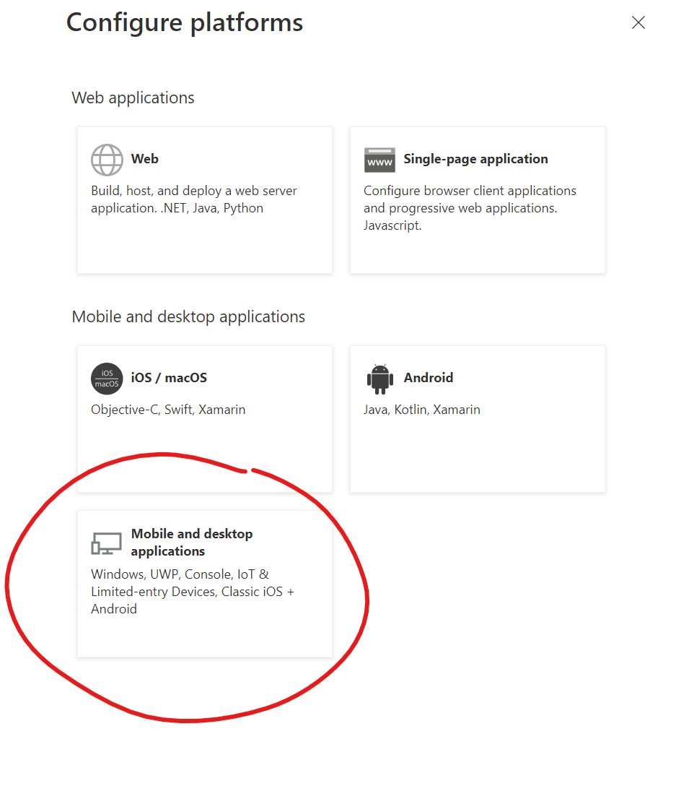
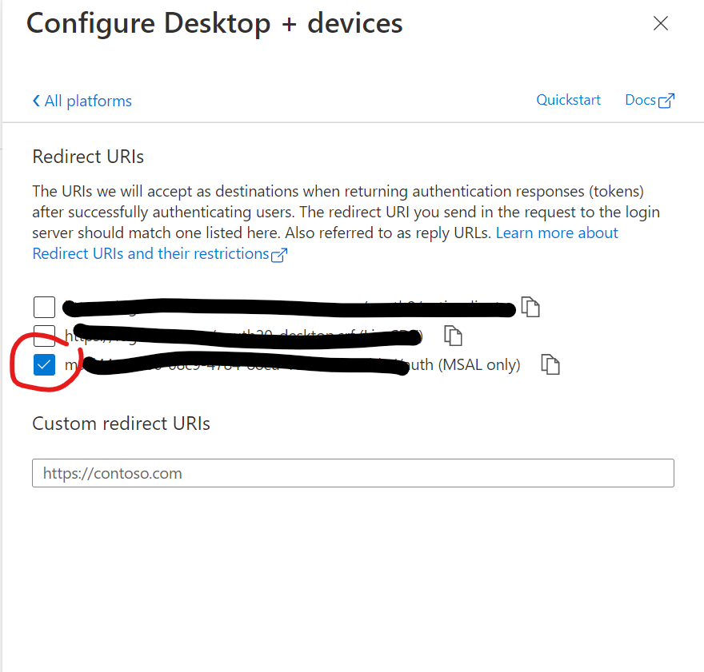
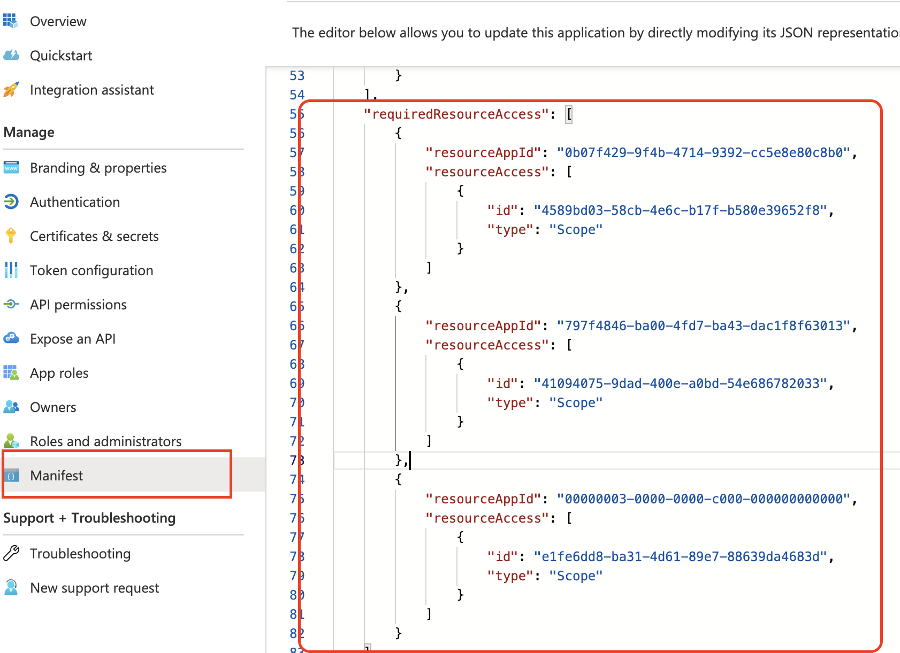
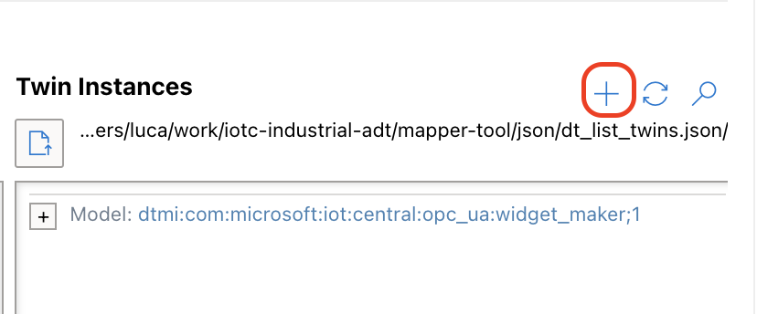
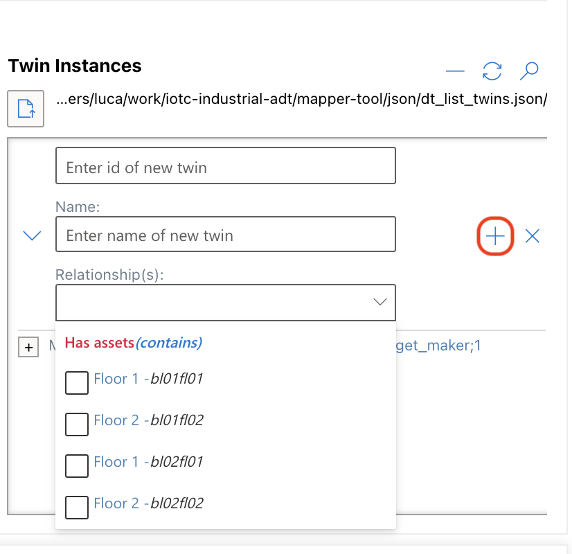

# OPCUA-ADT Mapping tool

Configuration tool to produce an IoT Central export query to transform OPCUA telemetry to Azure Digital Twins _update_ operations.

## Available Scripts

In the project directory, you can run:

### `npm start`

Runs the app in the development mode.\
Open [http://localhost:3000](http://localhost:3000) to view it in your browser.

The page will reload when you make changes.\
You may also see any lint errors in the console.

### `npm test`

Launches the test runner in the interactive watch mode.\
See the section about [running tests](https://facebook.github.io/create-react-app/docs/running-tests) for more information.

### `npm run make`

Builds the app for production to the `out` folder.

---

## How to use the mapping tool

The current version of this tool makes the following assumptions:

- The OPC-UA node hierarchy is known by the user and can be provided through a JSON file with format described in next section.
- The Twins for which mapping will not be defined but a potential relationship with them can be created, must exist.
- The input files are JSON files with the formats described in the next section.

### Input file formats:

- **OPCUA**: An array containing (possibly nested) objects.

  - There are three types of objects:
    1.  namespace object, which is a parent node in a node hierarchy and does not contain telemetry,
    2.  tag node, which represents telemetry, and
    3.  property, which describes a field of a complex type.
  - A namespace object should contain a key for each node it contains, where the key is the node id or name. If the namespace object represents an asset and directly contains tag nodes (telemetry), it should list the tag nodes in an array under the key, 'tags'.
  - A tag node, which represents a telemetry value, must include a node id and type. It may optionally include a name.
    - If the node type is a complex type, the tag node should include a 'properties' key that contains an array of property objects.
    - Properties are objects that contain a name and type. The type can recursively be complex; that is, if the type of the property is 'complex', it should contain a 'properties' key that lists the property objects of that type.
  - Following is an excerpt of sample input:
  <pre>
  [
      {
          "ContosoFactory": {
              "Building01": {
                  "Floor01": {
                      "Widget_Maker_1": {
                          "tags": [
                              {
                                  "nodeId": "ns=2;i=3",
                                  "name": "coolant_temp",
                                  "type": "Int16"
                              },
                              {
                                  "nodeId": "ns=2;i=4",
                                  "name": "vibration_3d",
                                  "type": "complex",
                                  "properties": [
                                      {
                                          "name": "x",
                                          "type": "Float"
                                      },
                                      {
                                          "name": "y",
                                          "type": "Float"
                                      },
                                      {
                                          "name": "z",
                                          "type": "Float"
                                      },
                                      {
                                          "name": "frequency",
                                          "type": "complex",
                                          "properties": [
                                              {
                                                  "name": "treble",
                                                  "type": "Float"
                                              },
                                              {
                                                  "name": "base",
                                                  "type": "Float"
                                              }
                                          ]
                                      }
                                  ]
                              },
                              {
                                  "nodeId": "ns=2;i=5",
                                  "name": "spindle_rpm",
                                  "type": "Int16"
                              },
                              {
                                  "nodeId": "ns=2;i=6",
                                  "name": "widget_count",
                                  "type": "Int16"
                              }
                          ]
                      },
  </pre>

- **ADT Twin Instances**: The format of the Digital twin instances input is a subset of the response returned by the Digital Twin's [Query Twins REST API](https://docs.microsoft.com/en-us/rest/api/digital-twins/dataplane/query/querytwins). The response properties required for the Twins input file are **$dtId** and **$metadata** (and its contents). If a property called **name** is defined for the twin, this property will be used as the twin's friendly name and displayed in the mapping tool. The API response can be directly used as input; any unneeded properties will be ignored. Note that **continuationToken**, if present, will also be ignored. That means that if your twins query returns multiple pages of responses, you will need to concatenate all the responses' **value** arrays into a single array.

- **ADT Models**: The DTDL models for the twin instances should be provided as the input. These models can be retrieved by calling the [DigitalTwinsModels List](<https://docs.microsoft.com/en-us/rest/api/digital-twins/dataplane/models/digitaltwinmodels_list#list-models-(include-dependencies-and-definitions)>) API and including the **includeModelDefinition** URI parameter.

### Setup Azure authentication (optional)

The tool, if configured with authentication details, can load Azure Digital Twins data (models and digital twins) directly from an existing instance. This can be useful when ontology or twins structure may change or when generating a static file is not possible.

Follow these steps to configure the tool before building it:

1. Create an Azure App Registration ([https://docs.microsoft.com/en-gb/graph/auth-register-app-v2](https://docs.microsoft.com/en-gb/graph/auth-register-app-v2)).
   - Make sure to add "Mobile and desktop applications" platform and select the "MSAL only" redirect URI provided by default. Also copy its value as will be needed for configuration.
   
   <!-- --> | <!-- -->
   :---|---:
   |
2. 
Edit required permissions in the application manifest.
   Under the _"requiredResourceAccess"_ section, add the items shown below:
   

```json
{
			"resourceAppId": "0b07f429-9f4b-4714-9392-cc5e8e80c8b0",
			"resourceAccess": [
				{
					"id": "4589bd03-58cb-4e6c-b17f-b580e39652f8",
					"type": "Scope"
				}
			]
		},
		{
			"resourceAppId": "797f4846-ba00-4fd7-ba43-dac1f8f63013",
			"resourceAccess": [
				{
					"id": "41094075-9dad-400e-a0bd-54e686782033",
					"type": "Scope"
				}
			]
		},
		{
			"resourceAppId": "00000003-0000-0000-c000-000000000000",
			"resourceAccess": [
				{
					"id": "e1fe6dd8-ba31-4d61-89e7-88639da4683d",
					"type": "Scope"
				}
			]
		}
```

3. Copy "Redirect URI" from the step above and both "Application (client) ID" and "Directory (tenant) ID" from the _Overview_ tab of the application in the portal.
4. Create a file called _".env"_ in the tool root folder and add these lines replacing values with inputs from the previous steps:

```env
CLIENT_ID = <APPLICATION_CLIENT_ID>
TENANT_ID = <DIRECTORY_ID>
REDIRECT_URL = <PLATFORM_REDIRECT_URI>
```

### Mapping

1. Start by loading the JSON files for the OPC-UA nodes, the Digital Twin instances and the Digital Twin models that describe those instances.
   Select the file load buttons \
    \
   at the top of each input column to open the file load dialog, navigate to and select the desired input file.

2. After loading the input files, mapping the nodes is fairly straightforward:

    In the OPCUA column, click on the tag node (telemetry) you want to map.

    In the Models column, click on the property of the twin that should receive the telemetry data.

    In the Twin instances column, click on the instance to which you want to map the selected OPCUA node's telemetry.
   If you have created a new twin, this will appear at the end of the list (see next section).

    When a row is selected, its pertinent content (needed to generate the JQ transformation) is loaded into the working row in the **Add/Update Mapping** section. Once the working row has all three inputs, the **Add** button will be enabled and you can save the mapped row.


- To update a mapped row, first select it by hovering over the row and clicking the check-circle that appears at the start of the row. The checked row's contents will be filled into the working row and the corresponding rows in the input columns will be highlighted. Choose the desired input row(s) and then press the 'Update' button.
- Hover over a mapped row to see the details of mapping.
- The **Filter** field can be used to filter the view of the mapped rows.

### Create new twins

The tool allows to define mappings containing details needed for automatic creation of Digital Twins during telemetry flow.

1. Select OPC node and property from the "Models" view.
2. Click on the "+" icon of the "Twin Instances" to show the "New Twin" form.
   
3. Insert the Id for the twin to be created.
   - (optional) advanced options are available by expanding the form clicking on the left arrow icon; those include a friendly name for the twin (see [Special Properties](../docs/setup.md#special-properties)) and available parent relationships.
     
4. Click on the "+" button to save the new twin.

   > This will not really create the digital twin on the ADT instance but just a new selectable entry in the twins list to be used for the mapping. The actual twin will be then created once telemetry for the defined property reaches the export pipeline in IoT Central.
