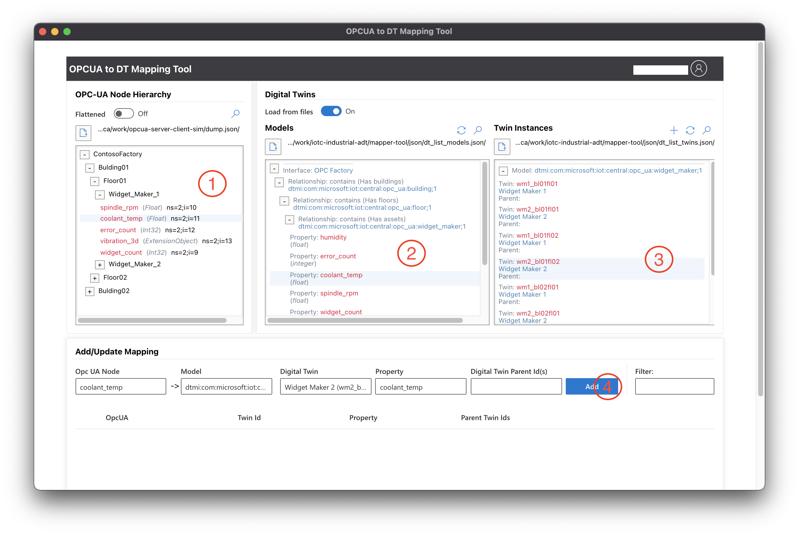

# OPCUA-ADT Mapping tool

Configuration tool to produce an IoT Central export query to transform OPCUA telemetry to Azure Digital Twins _update_ operations.

## Available Scripts

In the project directory, you can run:

### `npm start`

Runs the app in the development mode.\
Open [http://localhost:3000](http://localhost:3000) to view it in your browser.

The page will reload when you make changes.\
You may also see any lint errors in the console.

If you see 'unable to load preload.js' in the console, make a small edit to app.tsx (e.g., add a space after the first global declaration) and save. The error will go away on hot reload. This issue only occurs in development mode.

### `npm test`

Launches the test runner in the interactive watch mode.\
See the section about [running tests](https://facebook.github.io/create-react-app/docs/running-tests) for more information.

### `npm run make`

Builds the app for production to the `out` folder.

---

## How to use the mapping tool

The current version of this tool makes the following assumptions:

- The Twins to which you want to map the OPC-UA data already exist.
- The OPC-UA node hierarchy, the list of existing Digital Twins and their models are co-located with the tool so that they can be loaded in using a file load dialog.
- The input files are JSON files with the formats described in the next section.

#### Input file formats:

- **OPCUA**: An array containing (possibly nested) objects.

  - There are two types of objects: 1) namespace object, which is a parent node in a node hierarchy and does not contain telemetry, and 2) tag node, which represents telemetry.
  - A namespace object should contain a key for each nested object where the key is the node id or name of the nested object. If the namespace object contains telemetry (tag nodes), it should provide the tag nodes in an array under the key, 'tags'.
  - A tag node must include a node id and type. It may optionally include a name.
    - If the type is a complex type, the tag node should include a 'properties' key that contains an array of the properties.
    - Properties are objects that contain a name and type. The type can recursively be complex.
  - Following is sample input:
  <pre>
  [
      {
          "ContosoFactory": {
              "Building01": {
                  "Floor01": {
                      "Widget_Maker_1": {
                          "tags": [
                              {
                                  "nodeId": "ns=2;i=3",
                                  "name": "coolant_temp",
                                  "type": "Int16"
                              },
                              {
                                  "nodeId": "ns=2;i=4",
                                  "name": "vibration_3d",
                                  "type": "complex",
                                  "properties": [
                                      {
                                          "name": "x",
                                          "type": "Float"
                                      },
                                      {
                                          "name": "y",
                                          "type": "Float"
                                      },
                                      {
                                          "name": "z",
                                          "type": "Float"
                                      },
                                      {
                                          "name": "frequency",
                                          "type": "complex",
                                          "properties": [
                                              {
                                                  "name": "treble",
                                                  "type": "Float"
                                              },
                                              {
                                                  "name": "base",
                                                  "type": "Float"
                                              }
                                          ]
                                      }
                                  ]
                              },
                              {
                                  "nodeId": "ns=2;i=5",
                                  "name": "spindle_rpm",
                                  "type": "Int16"
                              },
                              {
                                  "nodeId": "ns=2;i=6",
                                  "name": "widget_count",
                                  "type": "Int16"
                              }
                          ]
                      },
  </pre>

- **ADT Twin Instances**: Digital twin instances should come in the format described by ...
- **ADT Models**: DTDL models for the twin instances should be provided...

#### Mapping

1. Start by loading the JSON files for the OPC-UA nodes, the Digital Twin instances and the Digital Twin models that describe those instances.
   Select the file load buttons at the top of each input column to open the file load dialog, navigate to and select the desired input file.

2. After loading the input files, mapping the nodes is fairly straightforward:
   - In the OPCUA column, click on the tag node (telemetry) you want to map.
   - In the Twin instances column, click on the instance to which you want to map the selected OPCUA node's telemetry.
   - In the Models column, click on the property of the twin that should receive the telemetry data.

- Each clicked row will be highlighted. To deselect it, click it again.
- When a row is selected, its pertinent content (needed to generate the JQ transformation) is loaded into the working row in the **Add/Update Mapping** section. Once the working row has all three inputs, the **Add** button will be enabled and you can save the mapped row.
- To update a mapped row, first select it by hovering over the row and clicking the check-circle that appears at the start of the row. The checked row's contents will be filled into the working row and the corresponding rows in the input columns will be highlighted. Choose the desired input row(s) and then press the 'Update' button.
- Hover over a mapped row to see the details of mapping.
- The **Filter** field can be used to filter the view of the mapped rows.

