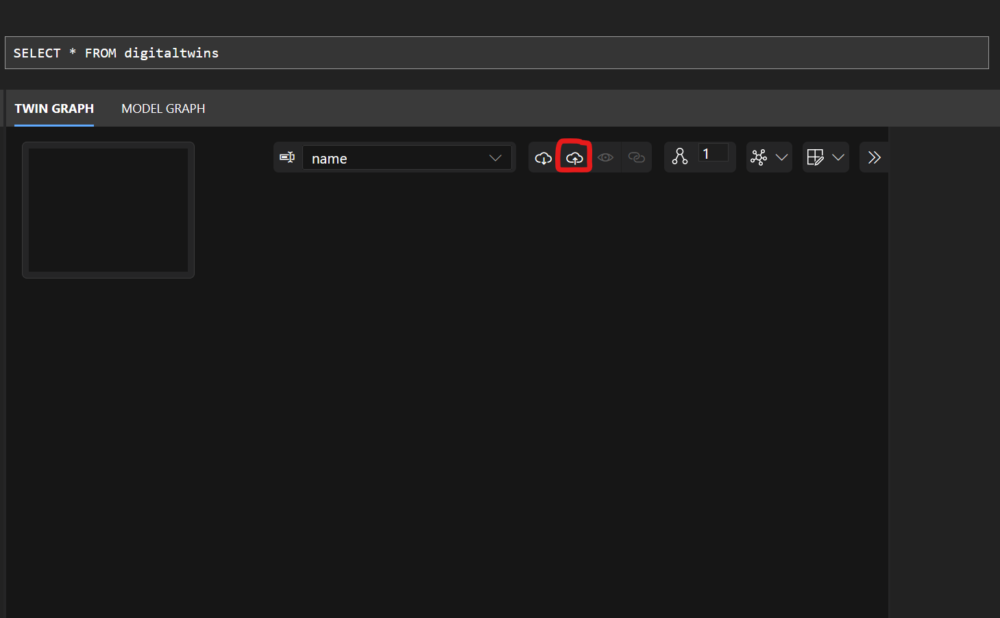
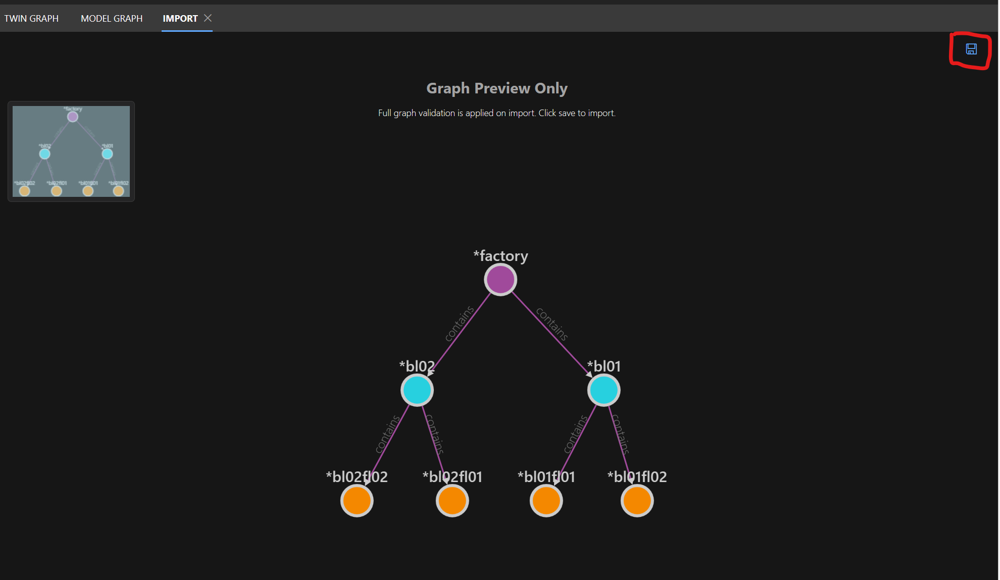
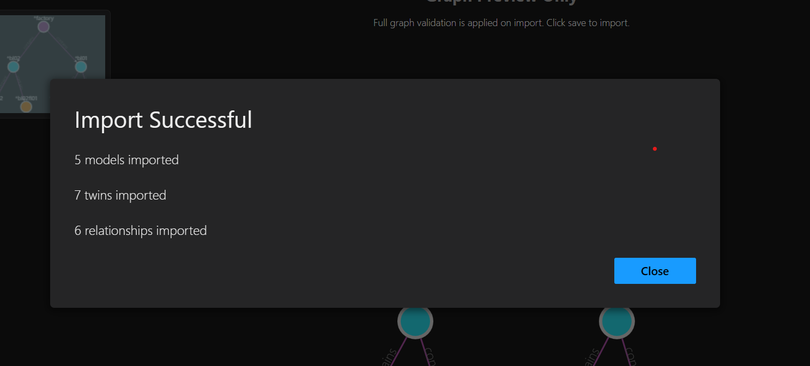

# Sample artifacts

This folder contains a sample ontology to be loaded in Azure Digital Twins.

-   1 Factory
-   2 Buildings
-   4 Floors (2 for each building)

It does not include leaf twins (e.g. assets) that can be automatically created during telemetry flow when necessary fields are present in the transformation query (see [How to use the mapping tool](../mapper-tool/README.md#how-to-use-the-mapping-tool)).

## Populate Azure Digital Twins

The _adt-graph.json_ file can be imported into the Azure Digital Twins Explorer. It will load both models and base twins.
Use the import button in the ADT explorer and hit the save button to confirm.

## Load sample data in mapper tool (optional)

Mapper tool can run either with Azure Active Directory connection or with manually loaded files.
Load these files to create mappings:

| File Name       | Section                        |
| --------------- | ------------------------------ |
| _opc_dump.json_ | "OPC-UA Node Hierarchy"        |
| _models.json_   | "Digital Twins/Models"         |
| _twins.json_    | "Digital Twins/Twin Instances" |
